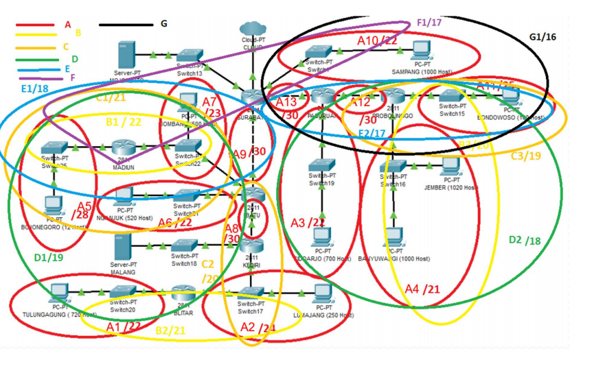
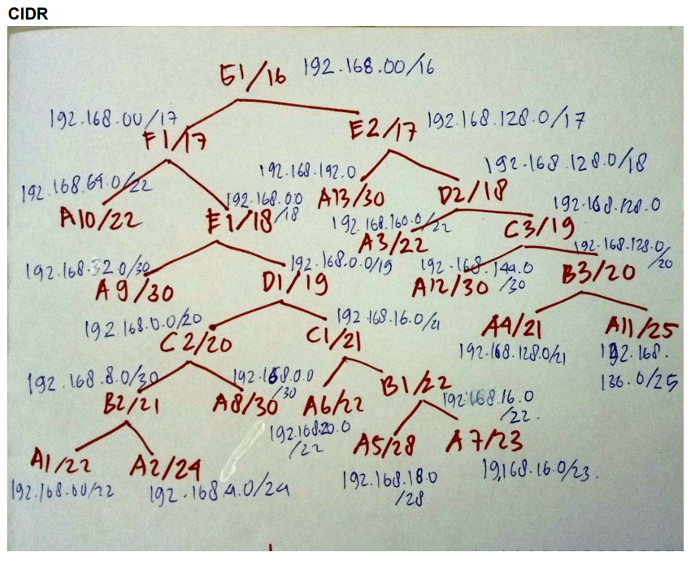
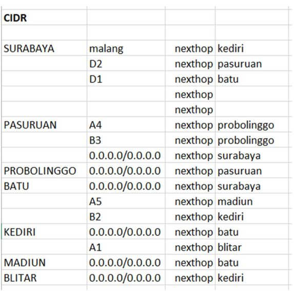

# Lapres_Modul4_JarkomA_A14
Laporan Resmi Modul 4 Praktikum Jaringan Komputer
#
- Rofita Siti Musdalifah    (05111840000034)
- Vachri Attala Putra       (05111840000043)
#

# Subnetting CIDR
## Pembagian Subnet
>

## Tree CIDR
>

## Routing
>

## UML
>topologi.sh
```
# Switch
uml_switch -unix switch1 > /dev/null < /dev/null &
uml_switch -unix switch2 > /dev/null < /dev/null &
uml_switch -unix switch3 > /dev/null < /dev/null &
uml_switch -unix switch4 > /dev/null < /dev/null &
uml_switch -unix switch5 > /dev/null < /dev/null &
uml_switch -unix switch6 > /dev/null < /dev/null &
uml_switch -unix switch7 > /dev/null < /dev/null &
uml_switch -unix switch8 > /dev/null < /dev/null &
uml_switch -unix switch9 > /dev/null < /dev/null &
uml_switch -unix switch10 > /dev/null < /dev/null &
uml_switch -unix switch11 > /dev/null < /dev/null &
uml_switch -unix switch12 > /dev/null < /dev/null &
uml_switch -unix switch13 > /dev/null < /dev/null &
uml_switch -unix switch14 > /dev/null < /dev/null &
uml_switch -unix switch15 > /dev/null < /dev/null &

# Router
xterm -T SURABAYA -e linux ubd0=SURABAYA,jarkom umid=SURABAYA eth0=tuntap,,,10.151.72.61 eth1=daemon,,,switch2 eth2=daemon,,,switch3 eth3=daemon,,,switch7 eth4=daemon,,,switch1 mem=64M &
xterm -T PASURUAN -e linux ubd0=PASURUAN,jarkom umid=PASURUAN eth0=daemon,,,switch4 eth1=daemon,,,switch8 eth2=daemon,,,switch3 mem=64M &
xterm -T PROBOLINGGO -e linux ubd0=PROBOLINGGO,jarkom umid=PROBOLINGGO eth0=daemon,,,switch15 eth1=daemon,,,switch9 eth2=daemon,,,switch4 mem=64M &
xterm -T BATU -e linux ubd0=BATU,jarkom umid=BATU eth0=daemon,,,switch7 eth1=daemon,,,switch11 eth2=daemon,,,switch10 eth3=daemon,,,switch6 mem=64M &
xterm -T KEDIRI -e linux ubd0=KEDIRI,jarkom umid=KEDIRI eth0=daemon,,,switch11 eth1=daemon,,,switch14 eth2=daemon,,,switch12 mem=64M &
xterm -T BLITAR -e linux ubd0=BLITAR,jarkom umid=BLITAR eth0=daemon,,,switch14 eth1=daemon,,,switch13 mem=64M &
xterm -T MADIUN -e linux ubd0=MADIUN,jarkom umid=MADIUN eth0=daemon,,,switch6 eth1=daemon,,,switch5 mem=64M &

# Server
xterm -T MALANG -e linux ubd0=MALANG,jarkom umid=MALANG eth0=daemon,,,switch12 mem=64M &
xterm -T MOJOKERTO -e linux ubd0=MOJOKERTO,jarkom umid=MOJOKERTO eth0=daemon,,,switch1 mem=64M &

# Client
xterm -T SAMPANG -e linux ubd0=SAMPANG,jarkom umid=SAMPANG eth0=daemon,,,switch2 mem=64M &
xterm -T BONDOWOSO -e linux ubd0=BONDOWOSO,jarkom umid=BONDOWOSO eth0=daemon,,,switch15 mem=64M &
xterm -T JEMBER -e linux ubd0=JEMBER,jarkom umid=JEMBER eth0=daemon,,,switch9 mem=64M &
xterm -T BANYUWANGI -e linux ubd0=BANYUWANGI,jarkom umid=BANYUWANGI eth0=daemon,,,switch9 mem=64M &
xterm -T SIDOARJO -e linux ubd0=SIDOARJO,jarkom umid=SIDOARJO eth0=daemon,,,switch8 mem=64M &
xterm -T LUMAJANG -e linux ubd0=LUMAJANG,jarkom umid=LUMAJANG eth0=daemon,,,switch14 mem=64M &
xterm -T TULUNGAGUNG -e linux ubd0=TULUNGAGUNG,jarkom umid=TULUNGAGUNG eth0=daemon,,,switch13 mem=64M &
xterm -T NGANJUK -e linux ubd0=NGANJUK,jarkom umid=NGANJUK eth0=daemon,,,switch10 mem=64M &
xterm -T BOJONEGORO -e linux ubd0=BOJONEGORO,jarkom umid=BOJONEGORO eth0=daemon,,,switch5 mem=64M &
xterm -T JOMBANG -e linux ubd0=JOMBANG,jarkom umid=JOMBANG eth0=daemon,,,switch6 mem=64M &
```
- Setting interface
  - Mojokerto
  ```
  auto lo
  iface lo inet loopback

  auto eth0
  iface eth0 inet static
  address 10.151.73.122
  netmask 255.255.255.252
  gateway 10.151.73.121

  ```
  - Malang
  ```
  auto lo
  iface lo inet loopback

  auto eth0
  iface eth0 inet static
  address 10.151.73.126
  netmask 255.255.255.252
  gateway 10.151.73.125

  ```
  - Surabaya
  ```
  auto lo
  iface lo inet loopback

  auto eth0
  iface eth0 inet static
  address 10.151.72.62
  netmask 255.255.255.252
  gateway 10.151.72.61

  auto eth1
  iface eth1 inet static
  address 192.168.64.1
  netmask 255.255.252.0

  auto eth2
  iface eth2 inet static
  address 192.168.192.1
  netmask 255.255.255.252
  auto eth3
  
  iface eth3 inet static
  address 192.168.32.1
  netmask 255.255.255.252

  auto eth4
  iface eth4 inet static
  address 10.151.73.121
  netmask 255.255.255.252
  ```
  - Pasuruan
  ```
  auto lo
  iface lo inet loopback

  auto eth0
  iface eth0 inet static
  address 192.168.144.1
  netmask 255.255.255.252

  auto eth1
  iface eth1 inet static
  address 192.168.192.2
  netmask 255.255.255.252
  gateway 192.168.192.1
  ```
  - Probolinggo
  ```
  auto lo
  iface lo inet loopback

  auto eth0
  iface eth0 inet static
  address 192.168.136.1
  netmask 255.255.255.128

  auto eth1
  iface eth1 inet static
  address 192.168.128.1
  netmask 255.255.248.0

  auto eth2
  iface eth2 inet static
  address 192.168.144.2
  netmask 255.255.255.252
  gateway 192.168.144.1
  ```
  - Batu
  ```
  auto lo
  iface lo inet loopback

  auto eth0
  iface eth0 inet static
  address 192.168.32.2
  netmask 255.255.255.252
  gateway 192.168.32.1

  auto eth1
  iface eth1 inet static
  address 192.168.0.1
  netmask 255.255.255.252

  auto eth2
  iface eth2 inet static
  address 192.168.20.1
  netmask 255.255.252.0

  auto eth3
  iface eth3 inet static
  address 192.168.16.1
  netmask 255.255.254.0
  ```
  - Madiun
  ```
  auto lo
  iface lo inet loopback

  auto eth0
  iface eth0 inet static
  address 192.168.16.2
  netmask 255.255.254.0
  gateway 192.168.16.1

  auto eth1
  iface eth1 inet static
  address 192.168.18.1
  netmask 255.255.255.240
  ```
  - Kediri
  ```
  auto lo
  iface lo inet loopback

  auto eth0
  iface eth0 inet static
  address 192.168.0.2
  netmask 255.255.255.252
  gateway 192.168.0.1

  auto eth1
  iface eth1 inet static
  address 192.168.4.2
  netmask 255.255.255.0

  auto eth2
  iface eth2 inet static
  address 10.151.73.125
  netmask 255.255.255.252
  ```
  - Blitar
  ```
  auto lo
  iface lo inet loopback

  auto eth0
  iface eth0 inet static
  address 192.168.4.1
  netmask 255.255.255.0
  gateway 192.168.4.2

  auto eth1
  iface eth1 inet static
  address 192.168.8.1
  netmask 255.255.252.0
  ```
  - Sampang
  ```
  auto lo
  iface lo inet loopback

  auto eth0
  iface eth0 inet static
  address 192.168.64.2
  netmask 255.255.252.0
  gateway 192.168.64.1
  ```
  - Bondowoso
  ```
  auto lo
  iface lo inet loopback

  auto eth0
  iface eth0 inet static
  address 192.168.136.2
  netmask 255.255.255.128
  gateway 192.168.136.1
  ```
  - Jember
  ```
  auto lo
  iface lo inet loopback

  auto eth0
  iface eth0 inet static
  address 192.168.132.1
  netmask 255.255.248.0
  gateway 192.168.128.1
  ```
  - Banyuwangi
  ```
  auto lo
  iface lo inet loopback

  auto eth0
  iface eth0 inet static
  address 192.168.128.2
  netmask 255.255.248.0
  gateway 192.168.128.1
  ```
  - Sidoarjo
  ```
  auto lo
  iface lo inet loopback

  auto eth0
  iface eth0 inet static
  address 192.168.160.2
  netmask 255.255.252.0
  gateway 192.168.160.1
  ```
  - Lumajang
  ```
  auto lo
  iface lo inet loopback

  auto eth0
  iface eth0 inet static
  address 192.168.4.3
  netmask 255.255.255.0
  gateway 192.168.4.2
  ```
  - Jombang
  ```
  auto lo
  iface lo inet loopback

  auto eth0
  iface eth0 inet static
  address 192.168.16.3
  netmask 255.255.254.0
  gateway 192.168.16.1
  ```
  - Nganjuk
  ```
   auto lo
  iface lo inet loopback

  auto eth0
  iface eth0 inet static
  address 192.168.20.2
  netmask 255.255.252.0
  gateway 192.168.20.1
  ```
  - Bojonegoro
  ```
  auto lo
  iface lo inet loopback

  auto eth0
  iface eth0 inet static
  address 192.168.18.2
  netmask 255.255.255.240
  gateway 192.168.18.1
  ```
  - Tulungagung
  ```
  auto lo
  iface lo inet loopback

  auto eth0
  iface eth0 inet static
  address 192.168.8.2
  netmask 255.255.252.0
  gateway 192.168.8.1

  ```
# Subnetting VLSM
